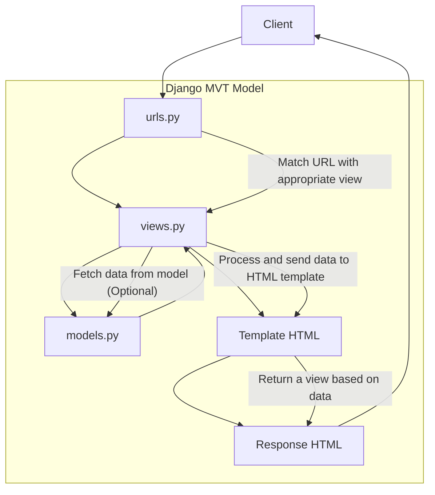

# bean-scape
Platform Based Programming (PBP) Course --- Tugas Individu 

## Bookmarks
- [Tugas 2](#tugas-2)
- [Tugas 3](#tugas-3)

## Tugas 2 <a id="tugas-2"></a>
[beanScape's url](http://rakabima-ghaniendra-beanscape.pbp.cs.ui.ac.id)
- Implementing Checklists
    1. Initialize repository
        * Create a new repository with the project's name `bean-scape`
        * Create a local directory with the same name
        * Link the local directory to the project's repository with `git add remote <repo's url>`
    2. Setup environment (Django)
        * Initialize python virtual environment (venv) with `python -m venv env` and activate with `env\Scripts\activate`
        * Install the requirements/dependencies using `pip install`
    3. Initialize Django project
        * Create a new Django project with `django-admin startproject`
        * Add the following `"localhost", "127.0.0.1"` to `ALLOWED_HOST` in `setting.py`
        * Create new app `main` with `python manage.py startapp main`
        * Add `main` to `INSTALLED_APPS` in `settings.py`
    4. Implement Django MVT (Model-View-Template)
        * Create model in `models.py`. Migrate every change with `python manage.py makemigrations` and `python manage.py migrate`
        * Create view function in `views.py`
        * Create HTMl template in `templates` directory
        * Configure URL routing in `urls.py` to link view with web URL
    5. Testing and deployment
        * Test by running the server with `python manage.py runserver`
        * Deploy app to hosting platform (Ex: Pacil Web Service)

- Diagram for client requests in Django

- Explanation:
    1. **Client**: The client sends an HTTP request to the Django server.
    2. **urls.py**: Django uses urls.py to match the requested URL 3.with the corresponding view function in views.py.
    3. **views.py**: The view function in views.py handles the request. It may need to fetch data from the database using models.py (optional).
    4. **models.py**: If the view requires interaction with the database, it retrieves or updates data through models.py.
    5. **Template HTML**: Once the data is processed, the view sends it to a template (HTML) for rendering.
    6. **Response HTML**: The template generates an HTML response based on the data provided.
    7. **Client**: The rendered HTML is sent back to the client, where it's displayed as a web page.

- Role of `git` in software development
    - **Version control**: Git keeps a detailed history of all changes made to the code, helping developers track progress.
    - **Collaboration**: It allows multiple developers to work on the same project simultaneously without conflicts.
    - **Branching**: Git lets developers create separate branches to work on new features or fixes without affecting the main codebase.
    - **Merging**: Changes from different branches can be combined, even if multiple developers are working on the same files.
    - **Conflict resolution**: Git helps identify and resolve conflicts when two developers make different changes to the same part of the code.
    - **Backup**: It provides a secure, distributed backup of the codebase, ensuring code is not lost.
    - **Rollback**: Developers can revert to previous versions of the project if something goes wrong. 
    - **Code review**: Git facilitates peer reviews through pull requests, improving code quality and collaboration.

- Why Django?
    - **Open Source**: Django is freely available and allows developers to modify the code, promoting flexibility and community collaboration.
    - **Fast**: Its built-in tools and automation features help developers quickly move from concept to deployment.
    - **Fully Loaded**: Django comes with essential features like authentication and content management out of the box, reducing the need for external tools.
    - **Secure**: With built-in protections against common threats, Django ensures high security for web applications.
    - **Scalable**: Django’s architecture supports easy scaling, making it ideal for both small projects and large-scale applications.
    - **Versatile**: Django’s flexibility allows it to be used for various web applications, from CMS to e-commerce platforms.

- Django ORM
    - Django's model is called an **Object-Relational Mapping (ORM)** because it allows developers to interact with the database using Python objects instead of SQL. The ORM maps Python classes (representing database tables) and their attributes (columns) to database records. This abstraction simplifies database operations like querying and updating data, making it more intuitive and efficient for developers to work with relational databases.

## Tugas 3 <a id="tugas-3"></a>
- Importance of data delivery in implementing a platform
    1. **Real-Time Information Availability**: Ensures that data accessed by users is always current and accurate, providing a seamless experience, especially in platforms like e-commerce or financial systems.
    2. **System Integration**: Facilitates smooth communication between different components of the platform, such as databases, front-end applications, and third-party services, ensuring they work together efficiently.
    3. **Data-Driven Decision Making**: Allows for timely delivery of data to analytics or machine learning systems, enabling better insights and more informed decision-making for business strategies.
    4. **Scalability and Reliability**: Supports the platform’s ability to handle growing user demands and large volumes of data without compromising on performance or speed.
    5. **Security and Privacy**: Ensures the safe transmission of sensitive data, such as personal or financial information, by implementing encryption and authentication protocols.
    6. **Efficiency of Resources**: Reduces the time and system resources required for data transfer, optimizing network usage and operational costs, making the platform more cost-effective.

- XML or JSON?
    - XML *Pros*:
        1. **Rich Structure**: XML supports complex data structures with nested hierarchies, making it useful for documents where structure is a priority.
        2. **Metadata with Attributes**: XML allows the use of attributes to store additional information about the data, which can be useful for more detailed data descriptions.
        3. **Standardized Schema Support**: XML has standardized schema languages (e.g., XSD) for defining structure and validating data.
        4. **Extensive Tooling**: There are many mature tools and libraries for processing, transforming (e.g., XSLT), and validating XML, making it valuable for certain legacy systems.
    - JSON *Pros*:
        1. **Simplicity and Readability**: JSON is lightweight, less verbose, and easier to read and write compared to XML. It has a simpler structure (key-value pairs) which reduces complexity.
        2. **Native Support in JavaScript**: JSON integrates seamlessly with JavaScript, making it the default choice for web applications. It is easily parsed and manipulated in JavaScript.
        3. **Faster Parsing**: JSON’s simpler structure makes it faster to parse than XML. Many modern programming languages, including JavaScript, Python, and Go, have native support for handling JSON.
        4. **Compactness**: JSON is less verbose, so it generally results in smaller file sizes, leading to faster transmission over networks.
    - Why is JSON More Popular than XML?
        - While XML is still useful for complex document structures and systems that require schema validation, JSON is preferred for modern web development and data exchange due to its <u>simplicity, efficiency, and tight integration with JavaScript</u>. This ease of use and performance advantage explains why JSON has become more popular in contemporary applications.

- `is_valid()` method in Django
    - Function of `is_valid()`:
        1. **Validation Check**: The primary function of is_valid() is to validate the data submitted through the form. It checks if all fields in the form meet the validation rules specified in the form’s model or custom validations (e.g., required fields, data type constraints, specific format checks).
        2. **Error Handling**: If the data is valid, is_valid() returns True; otherwise, it returns False and stores error messages related to the invalid fields in a form attribute called form.errors. This allows developers to easily display validation errors back to the user.
        3. **Data Cleaning**: In addition to validation, is_valid() also triggers the clean() method, which cleans and normalizes the form data. This ensures that the data is in a usable format before being processed or saved to the database.
    - Why is `is_valid()` necessary:
        1. **Data Integrity**: Using is_valid() ensures that only valid and clean data is processed, which helps maintain data integrity in the application. Invalid or corrupt data can lead to errors, security vulnerabilities, or broken functionality.
        2. **User Feedback**: It allows developers to provide feedback to users when they submit incorrect or incomplete data. The errors generated can be used to highlight issues, helping users correct them before resubmission.
        3. **Prevents Invalid Database Entries**: Without this method, invalid data might be saved to the database, leading to integrity issues. By validating before saving, is_valid() prevents saving incorrect or malformed data.
        4. **Automatic Handling of Validation**: Django provides built-in form validation (such as checking for required fields, data types, etc.), and is_valid() simplifies the process by running all the necessary validation checks with a single method call.

- Importance of `csrf_token`
    - Why do we need `csrf_token` in making a Django form?
    In Django, the csrf_token is necessary to protect against Cross-Site Request Forgery (CSRF) attacks. CSRF occurs when an attacker tricks a logged-in user into submitting a form or performing an action on a website without their knowledge. This could lead to unintended actions, such as changing user settings, transferring funds, or altering important data.

        Importance of csrf_token:
        - CSRF Attack Protection: The csrf_token acts as a unique, secret value that ensures the request comes from a legitimate user who accessed the form through the authorized website. Without this token, malicious websites could send unauthorized requests using the user's session.

        - Prevents Unauthorized Form Submissions: When a form submission does not include the correct csrf_token, Django rejects the request. This prevents attackers from submitting forged forms on behalf of the user.
        
    - What Happens Without csrf_token?
    Without a csrf_token, an attacker could exploit CSRF by crafting a malicious form and tricking a user into submitting it. The form would perform unauthorized actions like changing data or executing commands on behalf of the victim.

    - How Can Attackers Exploit This?
    An attacker can use a **Cross-Site Request Forgery (CSRF)** attack in combination with an **Insecure Direct Object Reference (IDOR)** vulnerability. IDOR occurs when an application allows users to access or modify data based on object IDs in the URL without proper authorization checks.

    - CSRF + IDOR exploit example:
        - Example URL: `http://targetsite.com/update_profile/3/  # Attacker's user ID`
        Since the URL exposes user_id, an attacker can change the user_id parameter to modify other users’ profiles by simply iterating over IDs
        `http://targetsite.com/update_profile/2/  # Changes email for user ID 2 to attacker@example.com`
        - If the form lacks a `csrf_token`, the attacker can trick the victim into  visiting a malicious website or clicking a button that triggers this unauthorized request. This combines the CSRF vulnerability (no `csrf_token`) with the IDOR vulnerability (lack of proper authorization checks), allowing the attacker to modify another user's sensitive information.

- Implementing Checklists
    1. Create Input Form to add Object Model
        a. Create `base.html` inside a new `templates` directory
        ```
        
        <!DOCTYPE html>
        <html lang="en">
            <head>
            <meta charset="UTF-8" />
            <meta name="viewport" content="width=device-width, initial-scale=1.0" />
             
            </head>

            <body>
             
            </body>
        </html>
        ```
        b. Create `forms.py` in project's directory
        ```
        from django.forms import ModelForm
        from main.models import Product

        class ProductRequestForm(ModelForm):
            class Meta:
                model = Product
                fields = ['name', 'price', 'description', 'category', 'bitterness']
        ```
        c. Create a new view for input form in `views.py`
        ```
        ...
        def create_product_request(request):
            form = ProductRequestForm(request.POST or None)
            
            if form.is_valid() and request.method == "POST":
                form.save()
                return redirect('main:show_main')
            
            context = {'form': form}
            return render(request, "create_product_request.html", context)
        ...
        ```
        d. Add new URL for the form in `urls.py` in app's directory
        ```
        ...
        urlpatterns = [
            path('', show_main, name='show_main'),
            path('create-product-request', create_product_request, name='create_product_request'),
        ]
        ....
        ```
    2. Create 4 view functions to show registered Objects in XML and JSON format in `views.py`
        a. View XML:
        ```
        ...
        def show_xml(request):
            data = ItemEntry.objects.all()
            return HttpResponse(serializers.serialize("xml", data), content_type="application/xml")
        ...
        ```
        b. View JSON:
        ```
        ...
        def show_json(request):
            data = ItemEntry.objects.all()
            return HttpResponse(serializers.serialize("json", data), content_type="application/json")
        ...
        ```
        c. View XML by ID:
        ```
        ...
        def show_xml_by_id(request, id):
            data = ItemEntry.objects.filter(pk=id)
            return HttpResponse(serializers.serialize("xml", data), content_type="application/xml")
        ...
        ```
        d. View JSON by ID:
        ```
        ...
        def show_json_by_id(request, id):
            data = ItemEntry.objects.filter(pk=id)
            return HttpResponse(serializers.serialize("json", data), content_type="application/json")
        ...
        ```
    3. Add URL routing for new view functions in `urls.py` in the app's directory
    ```
    from django.urls import path
    from main.views import show_main, create_product_request, show_json, show_xml, show_json_by_id, show_xml_by_id

    app_name = 'main'

    urlpatterns = [
        path('', show_main, name='show_main'),
        path('create-product-request', create_product_request, name='create_product_request'),
        path('xml/', show_xml, name='show_xml'),
        path('json/', show_json, name='show_json'),
        path('xml/<str:id>/', show_xml_by_id, name='show_xml_by_id'),
        path('json/<str:id>/', show_json_by_id, name='show_json_by_id')
    ]
    ```