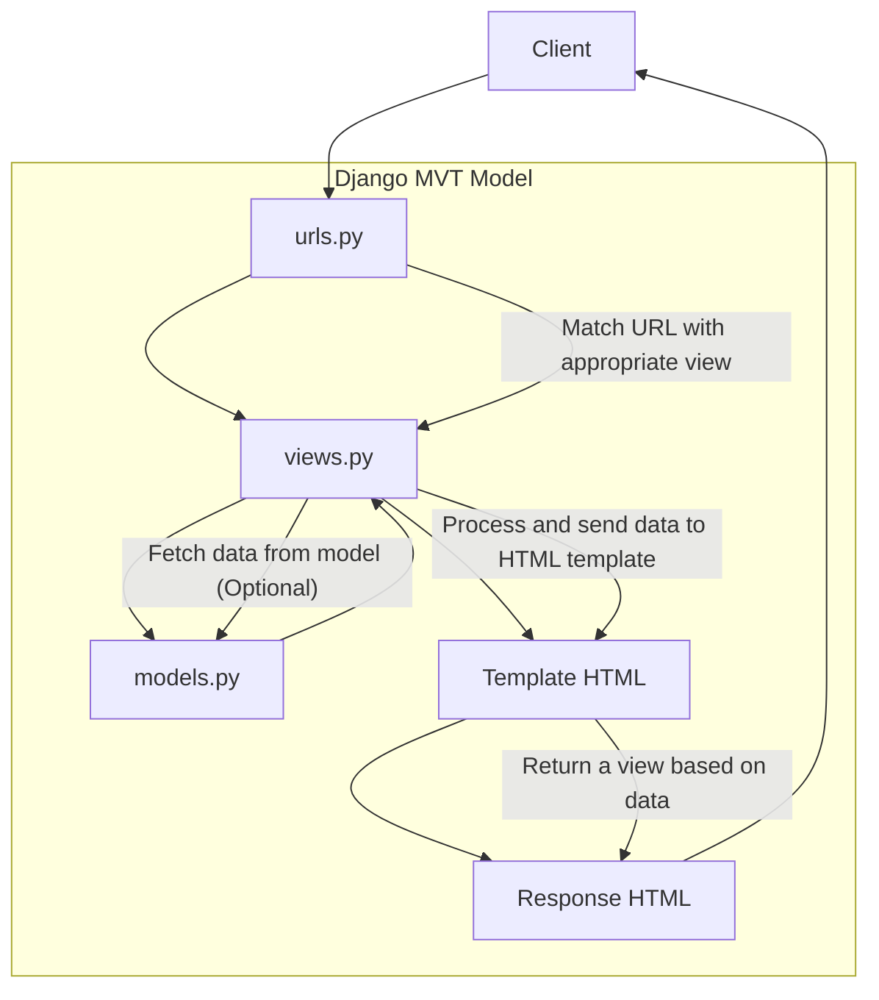

# bean-scape
Platform Based Programming (PBP) Course --- Tugas Individu 

# Tugas Individu 2
[beanScape's url](rakabima-ghaniendra-beanscape.pbp.cs.ui.ac.id)
- Implementing Checklists
    1. Initialize repository
        * Create a new repository with the project's name `bean-scape`
        * Create a local directory with the same name
        * Link the local directory to the project's repository with `git add remote <repo's url>`
    2. Setup environment (Django)
        * Initialize python virtual environment (venv) with `python -m venv env` and activate with `env\Scripts\activate`
        * Install the requirements/dependencies using `pip install`
    3. Initialize Django project
        * Create a new Django project with `django-admin startproject`
        * Add the following `"localhost", "127.0.0.1"` to `ALLOWED_HOST` in `setting.py`
        * Create new app `main` with `python manage.py startapp main`
        * Add `main` to `INSTALLED_APPS` in `settings.py`
    4. Implement Django MVT (Model-View-Template)
        * Create model in `models.py`. Migrate every change with `python manage.py makemigrations` and `python manage.py migrate`
        * Create view function in `views.py`
        * Create HTMl template in `templates` directory
        * Configure URL routing in `urls.py` to link view with web URL
    5. Testing and deployment
        * Test by running the server with `python manage.py runserver`
        * Deploy app to hosting platform (Ex: Pacil Web Service)

- Diagram for client requests in Django

Explanation:
a. **Client**: The client sends an HTTP request to the Django server.
b. **urls.py**: Django uses urls.py to match the requested URL 3.with the corresponding view function in views.py.
c. **views.py**: The view function in views.py handles the request. It may need to fetch data from the database using models.py (optional).
d. **models.py**: If the view requires interaction with the database, it retrieves or updates data through models.py.
e. **Template HTML**: Once the data is processed, the view sends it to a template (HTML) for rendering.
f. **Response HTML**: The template generates an HTML response based on the data provided.
g. **Client**: The rendered HTML is sent back to the client, where it's displayed as a web page.

- Role of `git` in software development
    - **Version control**: Git keeps a detailed history of all changes made to the code, helping developers track progress.
    - **Collaboration**: It allows multiple developers to work on the same project simultaneously without conflicts.
    - **Branching**: Git lets developers create separate branches to work on new features or fixes without affecting the main codebase.
    - **Merging**: Changes from different branches can be combined, even if multiple developers are working on the same files.
    - **Conflict resolution**: Git helps identify and resolve conflicts when two developers make different changes to the same part of the code.
    - **Backup**: It provides a secure, distributed backup of the codebase, ensuring code is not lost.
    - **Rollback**: Developers can revert to previous versions of the project if something goes wrong. 
    - **Code review**: Git facilitates peer reviews through pull requests, improving code quality and collaboration.

- Why Django?
    - **Open Source**: Django is freely available and allows developers to modify the code, promoting flexibility and community collaboration.
    - **Fast**: Its built-in tools and automation features help developers quickly move from concept to deployment.
    - **Fully Loaded**: Django comes with essential features like authentication and content management out of the box, reducing the need for external tools.
    - **Secure**: With built-in protections against common threats, Django ensures high security for web applications.
    - **Scalable**: Django’s architecture supports easy scaling, making it ideal for both small projects and large-scale applications.
    - **Versatile**: Django’s flexibility allows it to be used for various web applications, from CMS to e-commerce platforms.

- Django ORM
    Django's model is called an **Object-Relational Mapping (ORM)** because it allows developers to interact with the database using Python objects instead of SQL. The ORM maps Python classes (representing database tables) and their attributes (columns) to database records. This abstraction simplifies database operations like querying and updating data, making it more intuitive and efficient for developers to work with relational databases.