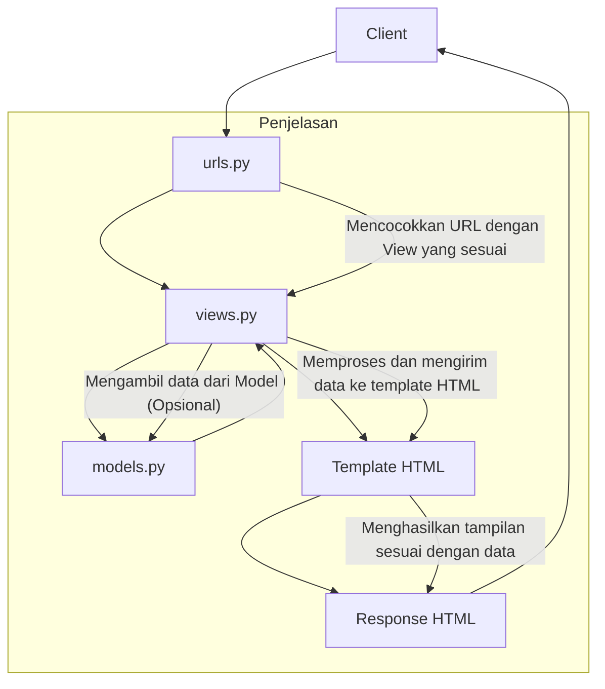

# bean-scape
Platform Based Programming (PBP) Course --- Tugas Individu 

# Tugas Individu 2
[beanScape's url](rakabima-ghaniendra-beanscape.pbp.cs.ui.ac.id)
- Implementing Checklists
    1. Initialize repository
        * Create a new repository with the project's name `bean-scape`
        * Create a local directory with the same name
        * Link the local directory to the project's repository with `git add remote <repo's url>`
    2. Setup environment (Django)
        * Initialize python virtual environment (venv) with `python -m venv env` and activate with `env\Scripts\activate`
        * Install the requirements/dependencies using `pip install`
    3. Initialize Django project
        * Create a new Django project with `django-admin startproject`
        * Add the following `"localhost", "127.0.0.1"` to `ALLOWED_HOST` in `setting.py`
        * Create new app `main` with `python manage.py startapp main`
        * Add `main` to `INSTALLED_APPS` in `settings.py`
    4. Implement Django MVT (Model-View-Template)
        * Create model in `models.py`. Migrate every change with `python manage.py makemigrations` and `python manage.py migrate`
        * Create view function in `views.py`
        * Create HTMl template in `templates` directory
        * Configure URL routing in `urls.py` to link view with web URL
    5. Testing and deployment
        * Test by running the server with `python manage.py runserver`
        * Deploy app to hosting platform (Ex: Pacil Web Service)
- Diagram for client requests in Django
